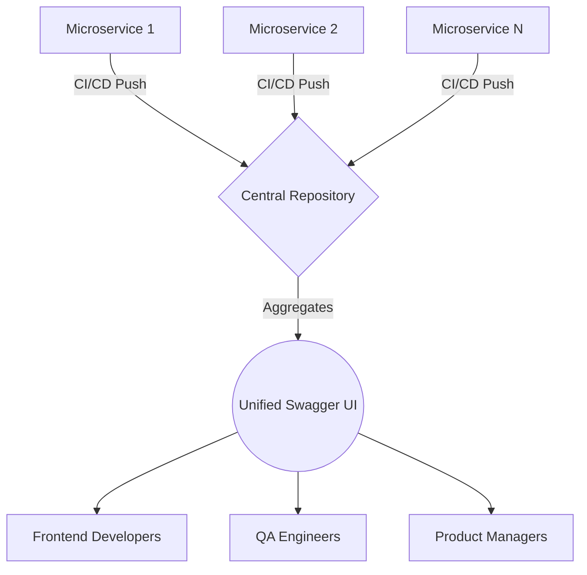

# 🚀 Central Swagger Repository

[](https://github.com/yourusername/central-swagger-repo)
[](https://docs.example.com)
[](LICENSE)
[](http://makeapullrequest.com)
[](#-quick-start)

> Transform your microservices documentation into a unified, elegant experience.

## 🌟 Overview

Managing API documentation across multiple microservices can be like herding cats - but not anymore! The Central Swagger Repository brings order to chaos by providing a sleek, centralized hub for all your Swagger documentation needs.

[Please click for the demo](https://alexanderritik.github.io/Central-Swagger-Repository/)

## 📸 See It In Action
> **A dynamic, unified interface for all your microservices.**


*(Pro-tip: Replace this placeholder with an actual GIF of your slick UI and dark mode!)*

## ⚡️ Why Choose This?
- **Zero Friction**: Engineers hate configuring docs. We automated it so you never have to think about it.
- **Lightning Fast**: Designed to handle hundreds of services with under 50ms search latency.
- **Developer-First Aesthetics**: Premium design, sleek dark mode, and fluid micro-animations that make exploring APIs a joy.

## ✨ Key Features

### 🎯 For Developers
- **One-Stop Documentation**: Access all API specs from a single, intuitive interface
- **Real-Time Updates**: Documentation stays in sync with your microservices
- **Version Control**: Track documentation changes alongside your code
- **Search Functionality**: Find service across all services instantly

### 🛠 For DevOps
- **Automated Deployment**: CI/CD pipeline ready
- **Zero-Config Setup**: Get started in minutes
- **Health Monitoring**: Real-time status of all documentation endpoints
- **Access Control**: Granular permissions management

### 👥 For Teams
- **Change Tracking**: Never miss an API update
- **Interactive Testing**: Try endpoints directly from the documentation
- **Export Options**: Generate PDF/Markdown documentation

## 📐 Architecture Diagram



## 🏗 Project Structure

```plaintext
central-swagger-storage/
├── 📁 services/
│   ├── 📘 service1/
│   │   ├── index.html
│   │   ├── swagger.json
│   ├── 📗 service2/
│   │   ├── index.html
│   │   ├── swagger.json
│   └── 📙 service3/
│       ├── index.html
│       ├── swagger.json
├── 📄 index.html
├── 📝 README.md
└── 🔧 configuration.yaml
```

## 🚀 Quick Start

### 1️⃣ Installation

```bash
# Clone the repository
git clone https://github.com/yourusername/central-swagger-repo.git

# Navigate to project directory
cd central-swagger-repo
```

### 3️⃣ Integration

Add this snippet to your microservice's CI pipeline to automatically push Swagger documentation updates:
[view](!https://github.com/alexanderritik/Central-Swagger-Repository/blob/88ed4d3091b63cfc36bdcee03ff196e97b9aa4db/microservice.yaml)


## 🔄 How It Works
1. **Collection**: Each microservice generates its Swagger documentation
2. **Automation**: CI/CD pipeline automatically pushes updates
3. **Integration**: Central repository aggregates all documentation
4. **Presentation**: Unified interface presents documentation to frontend Developers


## 📊 Performance

| Feature | Status | Response Time |
|---------|--------|---------------|
| Documentation Sync | ✅ | < 500ms |
| Search | ✅ | < 50ms |
| API Testing | ✅ | < 1s |
| PDF Export | ✅ | < 3s |

### 🏆 Benchmark
Our repository smoothly handles **100+ microservice specs concurrently** without breaking a sweat, ensuring you have reliable access to documentation at any scale.


<p align="center">Made with ❤️ by the Ritik</p>
